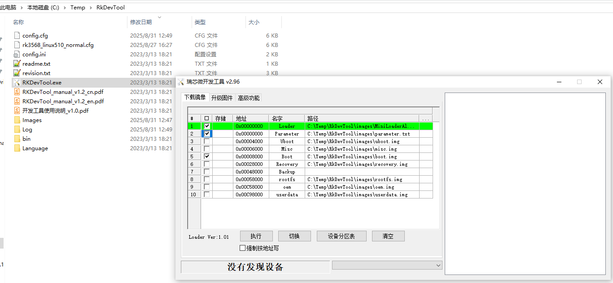

# Build Linux kernel and generate boot.img for Rockchip Linux
## 编译Rockchip的Linux kernel镜像并生成boot.img

### 为什么我要写这篇文章？

1. Rockchip Linux系统对原生Linux系统进行很多的完善优化，比如添加了类似Android构建系统的Lunch菜单，这样可以轻松添加不同的board类型，以便支持不同的开发板和项目，事实上我们目前也正在利用这个特征来支持我司的多个项目。另外，固件的Flash/eMMC镜像分区（采用GPT分区）也采用了类似Android的做法，包括uboot.img, boot.img, rootfs.img, misc.img 和recovery.img等分区文件。其中boot.img是Linux kernel的镜像，但是它不仅仅包含Linux kernel编译出来的Image文件，还包括设备树镜像.dtb文件，以及一些资源文件resource.img。而网络上的Linux编译介绍文章（典型的Linux kernel编译步骤），只会编译输出Linux kernel的镜像文件Image, 并不会生成boot.img文件。

2. Rockchip的Linux SDK，需要找Rockchip原厂申请权限，需要使用repo下载和更新代码，整个SDK包也非常的大，而对于我们dToF sensor应用项目来说，尤其是swift项目，我们的客户并不需要更新rootfs等镜像，而只需要更新kernel相关的boot.img, 外加少量的Linux 应用文件（这些不需要原厂的SDK支持），所以，我根据网上已有的资源，整理出了一个编译脚本，生成了一个小工具包。


### 下载地址：
[Ads6401_Linux_Driver](https://github.com/David1934/Ads6401_Linux_Driver)
除了小工具包，该git仓库还包括ads6401 驱动发布包.zip文件
```
./ads6401_linux_driver_code_v3.2.14_20250830191844.zip
./Build_boot_image_for_rockchip_Linux.md
./LICENSE
./Linux_Driver_porting_guide_4_ads6401.md
./README.md
./README_zh_CN.md
./tools/buildtools/build.sh
./tools/buildtools/device/rockchip/common/build.sh
./tools/buildtools/device/rockchip/common/mk-fitimage.sh
./tools/buildtools/device/rockchip/rk3568/boot.its
./tools/buildtools/device/rockchip/rk3568/parameter-buildroot-fit.txt
./tools/buildtools/prebuilts.tar.gz
./tools/buildtools/rk3568_linux_510_110_ads6401_for_mini_demo_box.patch
./tools/buildtools/rkbin/tools/mkimage
./tools/DriverAssitant_v5.12.zip
./tools/RkDevTool_2.96.zip
```
    
### 该工具包的主要功能：

A. 从git hub克隆一个开源的Rockchip Linux kernel源码
B. 使用示例的补丁包，生成ads6401 for mini demo box的完整驱动源码 （你也可以手动集成和个性化定制修改）
C. 编译内核镜像并生成boot.img文件（在rockdev目录下）
D. 清除kernel的编译结果

### 具体步骤：

1. 安装Linux开发环境 (make, git 等)

2. 从github上下载驱动源码及编译工具包
```
cd ~
git clone https://github.com/David1934/Ads6401_Linux_Driver
```

3. 解压编译工具包中的交叉编译工具链
```
cd Ads6401_Linux_Driver/tools/buildtools
tar zxvf prebuilts.tar.gz
```

4. 下载Rockchip的Linux kernel源码
```
cd Ads6401_Linux_Driver/tools/buildtools
./build.sh clone_kernel
# 将在当前目录下创建kernel目录，存储Rockchip Linux kernel的源码
```

5. 手动修改或应用示范的patch包（rk3568_linux_510_110_ads6401_for_mini_demo_box.patch）来修改好Linux kernel源码
```
# 该步骤仅用于演示Adaps公司Mini demo样机的kernel修改，你需要你的开发板和实际情况做合适的修改
./build.sh apply_patch
```

6. 编译和生成boot.img文件
```
./build.sh kernel
```

7. 烧录boot.img镜像到开发板上
   a. 在PC Windows下，安装Rockchip的usb驱动 （DriverAssitant_v5.12.zip，烧录Rk的固件需要的usb驱动）
   b. 在PC Windows下，解压瑞芯微的开发工具 （以解压到C:\Temp\RkDevTool为例)

   c. 导入开发板eMMC/Flash分区信息 （可由下列步骤导入, "路径"列的各个部件的image实际路径，可根据实际修改！）
 
 在截图的绿色框区域点击鼠标右键，将显示弹出菜单, 选择“导入配置”按钮，选择rk3568_linux510_normal.cfg文件
 
   d. 选择正确的boot.img路径，然后按“执行”按钮开始烧录
   

8. 验证驱动是否正常工作
