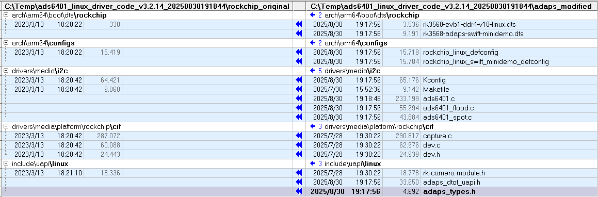

# Linux_Driver_porting_guide_for_ads6401

## A. ads6401驱动porting guide


#### 1. 环境准备
- **目标平台**：Rockchip RK3568 SoC
- **内核版本**：Linux 5.10.110（已验证兼容版本）
- **SDK包**：基于RK3568的Linux 5.10 SDK，其中`<rockchip_original>`目录Rk3568 Linux 5.10 SDK上原始的源文件，而`<adaps_modified>`是我们有修改和新增的文件


#### 2. 修改和新增的文件对比

   ```
kernel/arch/arm64/boot/dts/rockchip/rk3568-evb1-ddr4-v10-linux.dts
kernel/arch/arm64/configs/rockchip_linux_defconfig
kernel/drivers/media/i2c/ads6401.c
kernel/drivers/media/i2c/ads6401_flood.c
kernel/drivers/media/i2c/ads6401_spot.c
kernel/drivers/media/i2c/Kconfig
kernel/drivers/media/i2c/Makefile
kernel/drivers/media/platform/rockchip/cif/capture.c
kernel/drivers/media/platform/rockchip/cif/dev.c
kernel/drivers/media/platform/rockchip/cif/dev.h
kernel/include/uapi/linux/adaps_dtof_uapi.h
kernel/include/uapi/linux/adaps_types.h
kernel/include/uapi/linux/rk-camera-module.h
   ```


#### 3. 移植步骤
##### 3.1 代码集成
1. 将`<adaps_modified>`目录下的文件复制到SDK对应路径：
   - 头文件：`adaps_types.h`、`adaps_dtof_uapi.h`、`rk-camera-module.h` → 复制到`include/uapi/linux/`
   - 驱动文件：`ads6401*.c` → 复制到`drivers/media/i2c/`

2. 修改I2C驱动Makefile（`drivers/media/i2c/Makefile`），添加ADS6401驱动编译项：
   ```makefile
   # 在合适位置添加
   obj-$(CONFIG_VIDEO_ADS6401) += ads6401.o
   ```

3. 修改I2C驱动Kconfig（`drivers/media/i2c/Kconfig`），添加ADS6401驱动编译项：
   ```Kconfig
   # 在合适位置添加
   config VIDEO_ADS6401
	tristate "Adaps ADS6401 sensor support"
	depends on I2C && VIDEO_V4L2
	select V4L2_FWNODE
	help
	  This is a Video4Linux2 sensor driver for the Adaps Ads6401 camera.

	  To compile this driver as a module, choose M here: the
	  module will be called Ads6401.

   config SWIFT_MINI_DEMO_BOX
	bool "rk3568 Linux for ads6401 mini demo box"
	depends on VIDEO_ADS6401
	default n
	help
	  Enable this option to support rk3568 Linux for ads6401 mini demo box.

   ```

4. 修改Linux内核的功能配置选项文件（`arch\arm64\configs\rockchip_linux_defconfig`），添加一些编译选项：（我们内部的gerrit仓库上，我们有多个类似的文件，以便支持hawk,swift以及不同的转接板）
   ```
   # 在文件末尾添加
   # adaps modification for swift mini-demo-box on adaps rk3568 SoC mini board
   # CONFIG_DP83720_PHY=y
   CONFIG_USB_CONFIGFS_RNDIS=y
   CONFIG_USB_U_ETHER=y
   CONFIG_USB_F_RNDIS=y
   CONFIG_VIDEO_ADS6401=y
   CONFIG_SWIFT_MINI_DEMO_BOX=y
   ```

ADS6401支持SPOT和FLOOD两大模组类型（更多细分类型），在ads6401.c中通过宏定义来区分：
   ```
#define SWIFT_MODULE_TYPE               ADS6401_MODULE_SPOT  // ADS6401_MODULE_FLOOD
   ```


##### 3.3 编译与部署
1. 执行内核编译：
   ```bash
   make ARCH=arm64 rockchip_linux_defconfig
   make ARCH=arm64 -j8
   ```

2. 生成的内核镜像和驱动模块（若配置为模块）部署到RK3568开发板，重启生效。
Rockchip的SDK对内核进行了一些类似Android化的定制修改，可支持adb, kernel的烧录镜像文件使用boot.img, SDK里编译脚本build.sh提高lunch菜单来选择不同开发板类型，也提供自动将传统内核镜像文件Image转换为boot.img的自动化操作。客户应根据实际使用的平台，自己进行相应的处理。 


#### 4. 验证
- 检查驱动加载：`lsmod | grep ads6401` 或 `dmesg | grep DRV_ADS6401`
- 确认设备节点：`ls /dev/ads6401_misc`（ADS6401驱动中misc驱动的设备节点）
- 确认我们独有的设备属性是否存在：
   ```bash
   root@rk356x:~# find /sys -name register
   /sys/devices/platform/fe5d0000.i2c/i2c-4/4-005e/register

   root@rk356x:~# cat /sys/devices/platform/fe5d0000.i2c/i2c-4/4-005e/info
   Adaps ads6401 dToF sensor driver
   Version:                       3.2.11_LM20250822A
   Build Time:                    Fri Aug 22 12:01:10 CST 2025
   I2C Bus Num:                   4
   I2C bus frequency:             1000000Hz
   I2C address for ads6401:       0x5e
   Current TTY:                   pts0
   tdc_delay_major:               0xa
   tdc_delay_minor:               0x8

   root@rk356x:~# cat /sys/devices/platform/fe5d0000.i2c/i2c-4/4-005e/config
   Build switch options:
   ---------------------------------------------------------
   MINI_DEMO_BOX:                                     No
   ADS6401_MODULE_TYPE:                               Spot
   ENABLE_BIG_FOV_MODULE:                             No
   SENSOR_XCLK_FROM_SOC:                              Yes
   IGNORE_PROBE_FAILURE:                              Yes
   ...
   NON_CONTINUOUS_MIPI_CLK:                           Yes
   MIPI_DATA_LANE_COUNT:                              2
   MIPI_SPEED:                                        1000 Mbps
   SOC_MIPI_RX_CLOCK_FREQ:                            500 MHz
   EEPROM_CHIP_CAPACITY:                              65536 bytes
   ADAPS_DBG_ONCE:                                    0x400000
   ```


## B. ads6401驱动重要数据类型、数据结构介绍


#### 1. 模块类型区分
ADS6401驱动通过硬件标识和内核配置区分模组类型，定义于`adaps_types.h`：
- **SPOT散点模组**：`ADS6401_MODULE_SPOT = 0x6401A`（内置EEPROM P24C512X-C4H-MIR，VcselDriver OPN7020）
- **FLOOD小面阵模组**：`ADS6401_MODULE_FLOOD = 0x6401B`（内置EEPROM P24C256F-D4H-MIR，VcselDriver PhotonIC 5015等）
- **大FoV面阵模组**：`ADS6401_MODULE_BIG_FOV_FLOOD = 0x6401C`

在ads6401.c中通过宏定义来来选择模组类型。


#### 2. 核心数据结构与枚举
##### 2.1 基础类型定义
`adaps_types.h`中定义了驱动通用数据类型（如`UINT8`、`INT32`）和常量（如`TRUE/FALSE`、寄存器空值`REG_NULL=0xFF`），统一跨平台数据宽度。

##### 2.2 工作模式与参数
- **工作模式**（`swift_workmode_t`）：支持多种测距模式，如`ADAPS_PTM_PHR_MODE`（脉冲时间测量-相位高分辨率）、`ADAPS_PCM_MODE`（连续波模式）等。
- **帧率**（`AdapsFramerateType`）：支持15/25/30/60 FPS，控制传感器数据输出频率。
- **测量类型**（`AdapsMeasurementType`）：包括常规（Normal）、短距离（Short）、全量程（Full）测量，适配不同场景。
- **环境类型**（`AdapsEnvironmentType`）：区分室内（Indoor）/室外（Outdoor）环境，用于动态调整传感器参数（如Vcsel功率）。


#### 3. EEPROM数据结构
`adaps_dtof_uapi.h`定义了散点和小面阵模组的EEPROM的数据结构
   ```bash
#pragma pack(4)
typedef struct SwiftSpotModuleEepromData
{
    // In Swift EEPROM, one page has 64 bytes.
    // Page 1
    char            deviceName[SPOT_MODULE_DEVICE_NAME_LENGTH]; // Calibration version infomation
    // Page 2 - 65
    unsigned char   sramData[ALL_ROISRAM_GROUP_SIZE];
    // Page 66
    float           intrinsic[9];     // 36 bytes
    float           offset;           // 4 bytes
    __u32           refSpadSelection; // 4 bytes
    __u32           driverChannelOffset[4];  // 16 bytes
    __u32           distanceTemperatureCoefficient;
    // Page 67 - 186
    float           spotPos[SWIFT_MAX_SPOT_COUNT]; // 7680 bytes, 120 pages, reused for offset B and outdoor
    // Page 187 - 246
    float           spotOffset[SPOT_MODULE_OFFSET_SIZE]; // 3840 bytes, 60 pages, offset A
    // Page 247
    __u32           tdcDelay[16]; // 64 bytes
    // Page 248
    float           indoorCalibTemperature; // Calibration temperature.
    float           indoorCalibRefDistance; // Calibration reference distance.
    float           outdoorCalibTemperature; // Calibration temperature.
    float           outdoorCalibRefDistance; // Calibration reference distance.
    float           calibrationInfo[12]; // reserved
    // Page 249 - 252 
    uint8_t         pxyHistogram[248]; // pxy histogram
    float           pxyDepth;          // pxy depth
    float           pxyNumberOfPulse;  // pxy number of pulse
    // Page 253
    uint16_t        markedPixels[32];  // 16 hot pixels, 16 dead pixels.
    // Page 254
    char            moduleInfo[SPOT_MODULE_INFO_LENGTH]; // adaps calibration info.
    //Page  255-256
    char            reserved1[SPOT_MODULE_MODULE_INFO_RESERVED_SIZE];
    //Page  257-622
    char            WalkError[SPOT_MODULE_WALKERROR_SIZE];
    //Page  623-736
    char            reserved2[SPOT_MODULE_WALKERROR_RESERVED_SIZE];
    //Page  737-796           
    float           SpotEnergy[SPOT_MODULE_SPOTENERGY_SIZE];

    float           RawDepthMean[SPOT_MODULE_SPOTENERGY_SIZE];
    //Page  796-1023
    char            noise[SPOT_MODULE_NOISE_SIZE];
    //Page  1024
    uint8_t            checksum[SPOT_MODULE_CHECKSUM_SIZE];
}swift_spot_module_eeprom_data_t;
#pragma pack()

#pragma pack(1)
typedef struct SwiftFloodModuleEepromData
{
    // In Swift EEPROM, one page has 64 bytes.
    // Page 0
    char            Version[FLOOD_MODULE_DEVICE_VERSION_LENGTH];//6
    char            SerialNumber[FLOOD_MODULE_DEVICE_SN_LENGTH];//16
    unsigned int    Crc32Pg0;//4
    unsigned char   Pg0Reserved[FLOOD_MODULE_PAGE0_RESERVED_SIZE];//38

    //page 1
    char            ModuleInfo[FLOOD_MODULE_DEVICE_MODULEINFO_LENGTH];//60
    unsigned int    Crc32Pg1; //4

    //page2
    unsigned char   tdcDelay[2];
    float           intrinsic[9]; // 36 bytes
    float           indoorCalibTemperature; // Calibration temperature.
    float           outdoorCalibTemperature; // Calibration temperature.
    float           indoorCalibRefDistance; // Calibration reference distance.
    float           outdoorCalibRefDistance; // Calibration reference distance.
    unsigned int    Crc32Pg2;
    unsigned char   Pg2Reserved[FLOOD_MODULE_EEPROM_PAGE_SIZE-2-36-16-4]; //64-2-36-16-4=6

    //page 3---66
    unsigned char   sramData[ALL_ROISRAM_GROUP_SIZE];// 512*8 ,BUT 480(datat)+4(crc) is valid for every 512 bytes

    //page 67-186
    float           spotOffset[FLOOD_MODULE_SWIFT_OFFSET_SIZE]; // 64*60=3840 bytes = 960*4, 60 pages  for one offset.  here we have 2 offset

    //page 187
    unsigned int    Crc32Offset[FLOOD_MODULE_OFFSET_NUM];
    unsigned char   Pg187Reserved[FLOOD_MODULE_EEPROM_PAGE_SIZE-32]; //64-32=32
}swift_flood_module_eeprom_data_t;
#pragma pack()
   ```

驱动通过该数据结构读取校准参数（如温度补偿系数），用于配置ROI SRAM寄存器，传给算法库用于深度计算。


#### 4. ads6401驱动实现的回调函数

##### 4.1 ads6401驱动入口和出口函数
   ```
static int __init sensor_mod_init(void)
{
    int32_t rc = 0;

    rc = i2c_add_driver(&cam_sensor_i2c_driver);
    if (rc < 0)
        DBG_ERROR( "i2c_add_driver failed rc = %d", rc);

    return rc;
}

static void __exit sensor_mod_exit(void)
{
    i2c_del_driver(&cam_sensor_i2c_driver);
}

   ```

##### 4.2 v4l2 camera驱动需要实现的一些关键回调函数
   ```
static int sensor_s_power(struct v4l2_subdev * sd, int on)；

static int sensor_s_stream(struct v4l2_subdev * sd, int on);

static int sensor_set_fmt(struct v4l2_subdev * sd, 
    struct v4l2_subdev_pad_config * cfg, 
    struct v4l2_subdev_format * fmt);

static void sensor_get_module_inf(struct sensor * sensor, 
    struct rkmodule_inf * inf)
{
    memset(inf, 0, sizeof(*inf));
    strscpy(inf->base.sensor, SENSOR_NAME, sizeof(inf->base.sensor));
    strscpy(inf->base.module, sensor->module_name, sizeof(inf->base.module));
    strscpy(inf->base.lens, sensor->len_name, sizeof(inf->base.lens));
}

static long sensor_ioctl(struct v4l2_subdev * sd, unsigned int cmd, void *arg)
{
    struct rkmodule_bus_config *bus_config;
    struct sensor *sensor = to_sensor(sd);
    long ret = 0;

    switch (cmd)
    {
        case RKMODULE_GET_MODULE_INFO:
            sensor_get_module_inf(sensor, (struct rkmodule_inf *) arg);
            break;

        case RKMODULE_GET_CSI_DSI_INFO:
            *(int *)arg = RKMODULE_CSI_INPUT;
            break;

        case RKMODULE_GET_BUS_CONFIG:
            bus_config = (struct rkmodule_bus_config *)arg;
            bus_config->bus.bus_type = V4L2_MBUS_CSI2_DPHY;
            bus_config->bus.lanes = sensor->mipi_data_lanes;
            /*
             * for rk356x: dphy0 is used just for full mode,
             *             dphy1 is used just for split mode,uses lane0_1,
             *             dphy2 is used just for split mode,uses lane2_3
             *
             * csi2_dphy0: used for csi2 dphy full mode,
                       is mutually exclusive with
                       csi2_dphy1 and csi2_dphy2
             * csi2_dphy1: used for csi2 dphy split mode,
                       physical lanes use lane0 and lane1,
                       can be used with csi2_dphy2  parallel
             * csi2_dphy2: used for csi2 dphy split mode,
                       physical lanes use lane2 and lane3,
                       can be used with csi2_dphy1  parallel
             *
             */
            bus_config->bus.phy_mode = PHY_SPLIT_01;
            break;

        default:
            ret = -ENOIOCTLCMD;
            break;
    }

    return ret;
}


static const struct v4l2_subdev_core_ops sensor_core_ops =
{
    .s_power            = sensor_s_power, 
    .ioctl                  = sensor_ioctl, 
};


static const struct v4l2_subdev_video_ops sensor_video_ops =
{
    .s_stream           = sensor_s_stream, 
};


static const struct v4l2_subdev_pad_ops sensor_pad_ops =
{
    .set_fmt            = sensor_set_fmt, 
};


static const struct v4l2_subdev_ops sensor_subdev_ops =
{
    .core               = &sensor_core_ops, 
    .video              = &sensor_video_ops, 
    .pad                = &sensor_pad_ops, 
};

   ```

##### 4.3 misc_dev设备的ioctl函数
   ```
static long misc_device_ioctl(struct file *file, unsigned int cmd, unsigned long arg)
{
    register_op_data_t register_op_data;
    u32 val32 = 0;
    u8 reg8 = 0;
#if (ADS6401_MODULE_FLOOD == SWIFT_MODULE_TYPE)
    u16 reg16 = 0;
#endif
    u8 val8 = 0;
    struct sensor *sensor = (struct sensor*) file->private_data;
    void __user *uarg = (void __user *)arg;
    long ret = 0;
    external_config_script_param_t ex_cfg_script_param;
    external_roisram_data_size_t ex_roisram_data_param;

    switch (cmd)
    {
        case ADAPS_GET_DTOF_MODULE_STATIC_DATA:
             ret = sensor_get_module_static_data(sensor, arg);
             break;

        case ADAPS_GET_DTOF_RUNTIME_STATUS_PARAM:
             ret = sensor_get_dtof_runtime_status_param(sensor, arg);
             break;

        case ADAPS_SET_DTOF_INITIAL_PARAM:
             ret = sensor_set_dtof_intial_param(sensor, arg);
             break;

        case ADAPS_GET_DTOF_EXPOSURE_PARAM:
             ret = sensor_get_exposure_param(sensor, arg);
             break;

        case ADTOF_SET_DEVICE_REGISTER:
            if (copy_from_user(&register_op_data, (register_op_data_t *)uarg, sizeof(register_op_data_t)))
            {
                ret = -EFAULT;
                break;
            }
#if (ADS6401_MODULE_FLOOD != SWIFT_MODULE_TYPE)
            if (I2C_ADDR_4_VCSELDRV == register_op_data.i2c_address)
            {
                reg8 = register_op_data.reg_addr & 0xFF;
                val8 = register_op_data.reg_val & 0xFF;
                ret = i2c_dev_burst_write_reg(sensor, sensor->vcsel_i2c, reg8, &val8, 1);
            }
            else 
#else
            if (I2C_ADDR_4_MCUCTRL == register_op_data.i2c_address)
            {
                reg16 = register_op_data.reg_addr;
                val8 = register_op_data.reg_val & 0xFF;
            	ret = mcuctrl_write_reg(sensor, reg16, &val8, 1);
            }
            else 
#endif
            {
                reg8 = register_op_data.reg_addr & 0xFF;
                val8 = register_op_data.reg_val & 0xFF;
                ret = sensor_burst_write_reg(sensor, reg8, &val8, 1);
            }
            break;

        case ADTOF_GET_DEVICE_REGISTER:
            if (copy_from_user(&register_op_data, (register_op_data_t *)uarg, sizeof(register_op_data_t)))
            {
                ret = -EFAULT;
                break;
            }

#if (ADS6401_MODULE_FLOOD != SWIFT_MODULE_TYPE)
            if (I2C_ADDR_4_VCSELDRV == register_op_data.i2c_address)
            {
                reg8 = register_op_data.reg_addr & 0xFF;
                ret = i2c_dev_read_reg(sensor, sensor->vcsel_i2c, reg8, 1, &val32);
                if (ret < 0) {
                    break;
                }
                register_op_data.reg_val = val32 & 0xFF;
            }
            else 
#else
            if (I2C_ADDR_4_MCUCTRL == register_op_data.i2c_address)
            {
                reg16 = register_op_data.reg_addr;
                ret = mcuctrl_reg_read(sensor, reg16, &val8);
                if (ret < 0) {
                    break;
                }
                register_op_data.reg_val = val8;
            }
            else 
#endif
            {
                reg8 = register_op_data.reg_addr & 0xFF;
                ret = sensor_read_reg(sensor, reg8, 1, &val32);
                if (ret < 0) {
                    break;
                }
                register_op_data.reg_val = val32 & 0xFF;
            }

            if (copy_to_user((register_op_data_t *)uarg, &register_op_data, sizeof(register_op_data_t)))
            {
                ret = -EFAULT;
                break;
            }
            break;


        default:
            ret = -ENOIOCTLCMD;
            DBG_NOTICE("Unhandled cmd:0x%x", cmd);
            break;
    }

    return ret;
}

   ```

#### 5. ads6401驱动实现的mmap的共享内存buffer (K = 1024)
|            名称            |  最大尺寸  |                                  作用                                   |        备注        |
| ------------------------- | --------- | ---------------------------------------------------------------------- | ------------------ |
| eeprom_data               | 64K bytes | 缓存从模组读出来的eeprom                                                 | 小面阵模组只有32K   |
| loaded_sensor_reg_setting | 2K bytes  | 从外部加载的swift寄存器配置数据                                           | 暂未Ready          |
| loaded_vcsel_reg_setting  | 2K bytes  | 从外部加载的vcsel driver寄存器配置数据<br>opn7020和PhotonIC 5015格式有差异 | 暂未Ready          |
| loaded_roi_sram           | 36K       | 从外部加载的ROI sram数据                                                 | 主要用于roi轮询功能 |

#### 6. ads6401驱动包含的i2c设备驱动
|        名称        |  i2c地址   |           注册方式           |                       作用                        |                  备注                   |
| ------------------ | --------- | --------------------------- | ------------------------------------------------ | --------------------------------------- |
| sensor i2c device  | 0x5E/0x4A | i2c_add_driver()            | swift设备驱动，也作为模组的主控                     | 在dts设备树里声明设备节点                 |
| dvcc_regulator_i2c | 0x45      | devm_i2c_new_dummy_device() | 控制TPS62864芯片输出dvcc 1.1v电压                  | 作为主驱动的附属驱动（**在转接板上**）     |
| vcsel_i2c          | 0x31      | devm_i2c_new_dummy_device() | 控制vcsel driver发光<opn7020>                     | 作为主驱动的附属驱动（**小面阵模组没有**） |
| mcuctrl            | 0x60      | devm_i2c_new_dummy_device() | 控制内置mcu的行为及vcsel driver发光<PhotonIC 5015> | 作为主驱动的附属驱动（**小面阵模组独有**） |
| eeprom_i2c         | 0x50      | devm_i2c_new_dummy_device() | 模组内置的eeprom读取（公司内部更新）                 | 作为主驱动的附属驱动                      |
