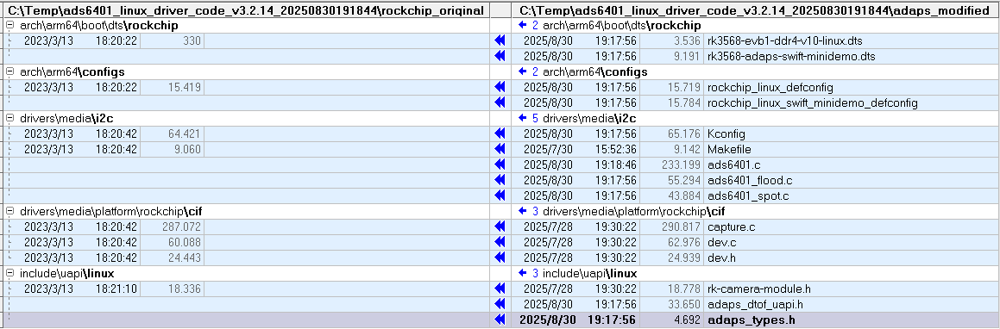

## **灵明光子 ADS6401 dToF 传感器Linux 驱动移植指南**
## Linux_Driver_porting_guide_for_ads6401

### 特别提醒
   1. 驱动程序跟硬件电路紧密相关，我们的驱动发布包仅供参考，客户应在充分理解驱动源码后，根据自己实际的硬件环境进行适当的修改（包括一些编译开关的配置）

#### 1. 从github下载最新的驱动发布包 和 编译工具包

[Ads6401_Linux_Driver](https://github.com/David1934/Ads6401_Linux_Driver)

#### 2. 参考设计的硬件软件环境
- **目标平台**：Rockchip RK3568 SoC
- **内核版本**：Linux 5.10.110
- **SDK包**：基于RK3568的Linux 5.10 SDK


#### 3. 修改和新增的文件列表


其中`<rockchip_original>`目录Rk3568 Linux 5.10 SDK上原始的源文件，而`<adaps_modified>`是我们有修改和新增的文件
   ```
kernel/arch/arm64/boot/dts/rockchip/rk3568-evb1-ddr4-v10-linux.dts
kernel/arch/arm64/configs/rockchip_linux_defconfig
kernel/drivers/media/i2c/ads6401.c
kernel/drivers/media/i2c/ads6401_flood.c
kernel/drivers/media/i2c/ads6401_spot.c
kernel/drivers/media/i2c/Kconfig
kernel/drivers/media/i2c/Makefile
kernel/drivers/media/platform/rockchip/cif/capture.c
kernel/drivers/media/platform/rockchip/cif/dev.c
kernel/drivers/media/platform/rockchip/cif/dev.h
kernel/include/uapi/linux/adaps_dtof_uapi.h
kernel/include/uapi/linux/adaps_types.h
kernel/include/uapi/linux/rk-camera-module.h
   ```


#### 4. 移植步骤
##### 4.1 代码集成
1. 将`<adaps_modified>`目录下的文件复制到SDK对应路径：
   - 头文件：`adaps_types.h`、`adaps_dtof_uapi.h`、`rk-camera-module.h` → 复制到`include/uapi/linux/`
   - 驱动文件：`ads6401*.c` → 复制到`drivers/media/i2c/`

2. 修改I2C驱动Makefile（`drivers/media/i2c/Makefile`），添加ADS6401驱动编译项：
   ```makefile
   # 在合适位置添加
   obj-$(CONFIG_VIDEO_ADS6401) += ads6401.o
   ```

3. 修改I2C驱动Kconfig（`drivers/media/i2c/Kconfig`），添加ADS6401驱动编译项：
   ```Kconfig
   # 在合适位置添加
   config VIDEO_ADS6401
	tristate "Adaps ADS6401 sensor support"
	depends on I2C && VIDEO_V4L2
	select V4L2_FWNODE
	help
	  This is a Video4Linux2 sensor driver for the Adaps Ads6401 camera.

	  To compile this driver as a module, choose M here: the
	  module will be called Ads6401.

   config SWIFT_MINI_DEMO_BOX
	bool "rk3568 Linux for ads6401 mini demo box"
	depends on VIDEO_ADS6401
	default n
	help
	  Enable this option to support rk3568 Linux for ads6401 mini demo box.

   ```

4. 修改Linux内核的功能配置选项文件（`arch\arm64\configs\rockchip_linux_defconfig`），添加一些编译选项：（我们内部的gerrit仓库上，我们有多个类似的文件，以便支持hawk,swift以及不同的转接板）
   ```
   # 在文件末尾添加
   # adaps modification for swift mini-demo-box on adaps rk3568 SoC mini board
   # CONFIG_DP83720_PHY=y
   CONFIG_USB_CONFIGFS_RNDIS=y
   CONFIG_USB_U_ETHER=y
   CONFIG_USB_F_RNDIS=y
   CONFIG_VIDEO_ADS6401=y
   # 下面这行仅在Adaps公司小型化样机上需要
   CONFIG_SWIFT_MINI_DEMO_BOX=y
   ```

ADS6401支持SPOT和FLOOD两大模组类型（更多细分类型），在ads6401.c中通过宏定义来区分：
   ```
#define SWIFT_MODULE_TYPE               ADS6401_MODULE_SPOT  // ADS6401_MODULE_FLOOD
   ```


##### 4.2 编译与部署
1. 典型的内核编译步骤：
   ```bash
   make ARCH=arm64 rockchip_linux_defconfig
   make ARCH=arm64 -j8
   ```

2. Rockchip公司对内核进行了一些类似Android化的定制修改，可支持adb, kernel的烧录镜像文件使用boot.img, 具体的步骤参加下列文章。客户应根据实际使用的平台，进行相应的处理。 
 
详见[编译Rockchip的Linux kernel镜像并生成boot.img](Build_boot_image_for_rockchip_Linux.md)


##### 4.3. 验证
  生成的内核镜像和驱动模块（若配置为模块）部署到RK3568开发板，重启生效。
- 检查驱动加载：`lsmod | grep ads6401` 或 `dmesg | grep DRV_ADS6401`
- 确认设备节点：`ls /dev/ads6401_misc`（ADS6401驱动中misc驱动的设备节点）
- 确认我们独有的设备属性是否存在：
   ```bash
   root@rk356x:~# find /sys -name register
   /sys/devices/platform/fe5d0000.i2c/i2c-4/4-005e/register

   root@rk356x:~# cat /sys/devices/platform/fe5d0000.i2c/i2c-4/4-005e/info
   Adaps ads6401 dToF sensor driver
   Version:                       3.2.11_LM20250822A
   Build Time:                    Fri Aug 22 12:01:10 CST 2025
   I2C Bus Num:                   4
   I2C bus frequency:             1000000Hz
   I2C address for ads6401:       0x5e
   Current TTY:                   pts0
   tdc_delay_major:               0xa
   tdc_delay_minor:               0x8

   root@rk356x:~# cat /sys/devices/platform/fe5d0000.i2c/i2c-4/4-005e/config
   Build switch options:
   ---------------------------------------------------------
   MINI_DEMO_BOX:                                     No
   ADS6401_MODULE_TYPE:                               Spot
   ENABLE_BIG_FOV_MODULE:                             No
   SENSOR_XCLK_FROM_SOC:                              Yes
   IGNORE_PROBE_FAILURE:                              Yes
   ...
   NON_CONTINUOUS_MIPI_CLK:                           Yes
   MIPI_DATA_LANE_COUNT:                              2
   MIPI_SPEED:                                        1000 Mbps
   SOC_MIPI_RX_CLOCK_FREQ:                            500 MHz
   EEPROM_CHIP_CAPACITY:                              65536 bytes
   ADAPS_DBG_ONCE:                                    0x400000
   ```

